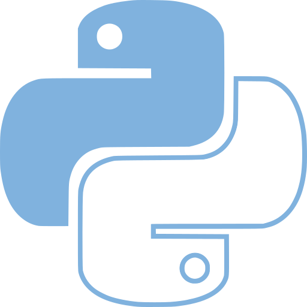

% Virtualenvs
% Miguel González
% 18 de junio de 2015

<script type='text/javascript' id="__bs_script__">//<![CDATA[
    document.write("<script async
    src='http://HOST:3000/browser-sync/browser-sync-client.2.7.9.js'><\/script>".replace("HOST", location.hostname));
//]]></script>



# Entornos virtuales

## Ventajas

1. Entorno independiente con posibilidad de tener distintas
   versiones a las del sistema (paquetes e intérprete).

2. No son necesarios permisos de administrador.

3. Herramientas para recrear el entorno en otros equipos.

# Por el principio

## Pythons

- Es un lenguaje interpretado

```
$ python hola.py
Hola mundo!
```

---

- Se puede hacer un pseudo ejecutable

*Linux*

```
$ cat hola.py
#!/usr/bin/env python
print('Hola mundo!')
$ chmod +x hola.py
$ ./hola.py
Hola mundo!
```

*Windows*

. . .

<span style='color:red'>¡Doble click!</span>

## ¿Y que estoy ejecutando?

1. La versión del intérprete de python en el PATH

2. Las librerías instaladas en la carpeta `site-packages`

## Un vistazo a un ubuntu

```
$ python --version
Python 2.7.6
$ which python
/usr/bin/python
$ ls -la /usr/bin/python2.7
-rwxr-xr-x 1 root root 3349512 Mar 22  2014 /usr/bin/python2.7
$ file /usr/bin/python2.7
/usr/bin/python2.7: ELF 64-bit LSB  executable, x86-64, ...
```
---

```
$ python
Python 2.7.6 (default, Mar 22 2014, 22:59:56)
[GCC 4.8.2] on linux2
Type "help", "copyright", "credits" or "license" for more information.
>>> import sys
>>> sys.path
['', '/usr/lib/python2.7', '/usr/lib/python2.7/plat-x86_64-linux-gnu',
 '/usr/lib/python2.7/lib-tk', '/usr/lib/python2.7/lib-old',
 '/usr/lib/python2.7/lib-dynload', '/home/vagrant/.local/lib/python2.7/site-packages',
 '/usr/local/lib/python2.7/dist-packages', '/usr/lib/python2.7/dist-packages']
```

---

```
$ tree /usr/lib/python2.7/dist-packages/  -L 1 -P *py -I *.egg-info
/usr/lib/python2.7/dist-packages/
|-- apport
|-- apport_python_hook.py
|-- apt
|-- aptsources
|-- axi
|-- chardet
|-- Cheetah
|-- cloudinit
|-- colorama
|-- configobj.py
|-- Crypto
|-- curl
|-- dbus
|-- deb822.py
|-- debconf.py
|-- debian
|-- debian_bundle
|-- distlib
|-- easy_install.py
|-- gi
|-- html5lib
|-- httplib2
|-- jsonpatch.py
|-- jsonpointer.py
|-- keyring
|-- landscape
|-- launchpadlib
|-- lazr
|-- lsb_release.py
|-- _markerlib
|-- oauth
|-- OpenSSL
|-- pip
|-- pkg_resources.py
|-- prettytable.py
|-- problem_report.py
|-- pygtkcompat
|-- requests
|-- secretstorage
|-- serial
|-- setuptools
|-- simplejson
|-- six.py
|-- twisted
|-- urllib3
|-- validate.py
|-- virtualenv.py
|-- wadllib
|-- wheel
|-- xapian
|-- yaml
`-- zope

38 directories, 14 files
```

# Entonces...

## Disclaimer

Algunas de las herramientas utilizadas hay que instalarlas y
configurarlas. Ver refrencias al final.

## Creación, activación y deasctivación entorno virtual

```
$ virtualenv mi-entorno
New python executable in mi-entorno/bin/python
Installing setuptools, pip...done.
$ source mi-entorno/bin/activate
(mi-entorno)$ which python
/home/vagrant/mi-entorno/bin/python
```

```
(mi-entorno)$ deactivate
$
```

## Internals

```
$ cd mi-entorno
$ tree -d -L 4 -I *.dist-info
.
|-- bin
|-- lib
|   `-- python2.7
|       |-- distutils
|       |-- encodings -> /usr/lib/python2.7/encodings
|       |-- lib-dynload -> /usr/lib/python2.7/lib-dynload
|       `-- site-packages
|           |-- _markerlib
|           |-- pip
|           `-- setuptools
`-- local
    |-- bin -> /home/vagrant/mi-entorno/bin
    `-- lib -> /home/vagrant/mi-entorno/lib
```

---


```
$ cat bin/activate

...

VIRTUAL_ENV="/home/vagrant/mi-entorno"
export VIRTUAL_ENV

...

_OLD_VIRTUAL_PATH="$PATH"
PATH="$VIRTUAL_ENV/bin:$PATH"
export PATH

...

hash -r 2>/dev/null
```

---

```
$ /home/vagrant/mi-entorno/bin/python
Python 2.7.6 (default, Mar 22 2014, 22:59:56)
[GCC 4.8.2] on linux2
Type "help", "copyright", "credits" or "license" for more information.
>>> import sys
>>> sys.path
['', '/home/vagrant/mi-entorno/lib/python2.7',
 '/home/vagrant/mi-entorno/lib/python2.7/plat-x86_64-linux-gnu',
 '/home/vagrant/mi-entorno/lib/python2.7/lib-tk',
 '/home/vagrant/mi-entorno/lib/python2.7/lib-old',
 '/home/vagrant/mi-entorno/lib/python2.7/lib-dynload',
 '/usr/lib/python2.7',
 '/usr/lib/python2.7/plat-x86_64-linux-gnu',
 '/usr/lib/python2.7/lib-tk',
 '/home/vagrant/mi-entorno/local/lib/python2.7/site-packages',
 '/home/vagrant/mi-entorno/lib/python2.7/site-packages']
>>>
```

# Ejemplos
 
 
## Práctica 1

- Crear virtualenv.
- Instalar paquetes.
- Crear archivo `requirements.txt`.

## Práctica 2

- Crear entorno virtual pero con Python 3.4.
- Instalar los mismos paquetes que en la práctica 1.

# Herramientas

### pip

Instalar paquetes

### virtualenvwrapper

Comandos para facilitar la gestión de entornos.

### autoenv

Auto activa el entorno al entrar y lo desactiva al salir.

### pythonz


## Enlaces

- [virtualenvwrapper](http://virtualenvwrapper.readthedocs.org/en/latest/index.html)
- [autoenv](https://github.com/kennethreitz/autoenv)
- [pythonz](https://github.com/saghul/pythonz)

## Bootstraping

- Ejemplo Ubuntu 14.04

## pip

```
$ sudo apt-get install python-pip python-virtualenv
$ pip install --user pip --upgrade
$ export PATH=$HOME/.local/bin:$PATH
```

## virtualenvwrapper

```
$ pip install --user virtualenvwrapper
$ cd ~/.Envs
$ vim .bashrc
...
export WORKON_HOME=~/Envs
source $HOME/.local/bin/virtualenvwrapper.sh
```

---

```
$ mkvirtualenv mi-entorno
New python executable in mi-entorno/bin/python
Installing setuptools, pip...done.
(mi-entorno)$ ls ~/Envs/ -l
total 52
...
drwxrwxr-x 5 vagrant vagrant 4096 Jun 18 16:46 mi-entorno
...
```

```
(mi-entorno)$ deactivate 
```

```
$ rmvirtualenv mi-entorno
Removing mi-entorno...
```

## pythonz

```
$ sudo apt-get install build-essential zlib1g-dev libbz2-dev libssl-dev libreadline-dev \
  libncurses5-dev libsqlite3-dev libgdbm-dev libdb-dev libexpat-dev libpcap-dev liblzma-dev \
  libpcre3-dev
$ curl -kL https://raw.github.com/saghul/pythonz/master/pythonz-install | bash

```

---

```
$ pythonz install 2.7.10
...
$ pythonz install 3.4.3
...
```

```
$ mkvirtualenv -p $(pythonz locate 2.7.10) mi-entorno-python2.7.10
```

# Gracias
