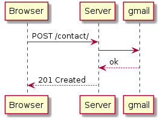
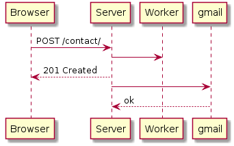
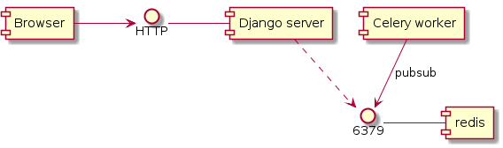

# Agiliza aplicaciónes web usando un worker con Django y Celery

## La vida de una petición HTTP

```
@startuml
Browser -> Server : POST /contact/
Server -> gmail
gmail --> Server : ok
Server --> Browser : 201 Created
@enduml
```
----



## Desacoplar usando un worker

```
@startuml
Browser -> Server : POST /contact/
Server -> Worker
Server --> Browser : 201 Created
Server -> gmail
gmail --> Server : ok
@enduml
```

----



## Broker

```
@startuml
[Browser] -> HTTP
HTTP - [Django server]

[Django server] ..> 6379
[Celery worker] --> 6379 : pubsub

6379 - [redis]
@enduml
```

----



## Show me the code

...

## Django bootrstrapping

```
mkdir pythonvigo
cd pythonvigo
```

```
python3 -m venv .venv
source .venv/bin/activate
pip install --upgrade pip
pip install wheel
```

```
pip install django
django-admin.py startproject pythonvigo
tree -P '**py'
cd pythonvigo
./manage.py migrate
./manage.py runserver
tree -P '**py'
```

## Turbo

```
git clone git@github.com:migonzalvar/pythonvigo.git
cd pythonvigo

python3 -m venv .venv
source .venv/bin/activate
pip install django

git checkout STEP_1
cd pythonvigo
./manage.py migrate
./manage.py runserver
```

----

https://asciinema.org/a/5hliyk9hnuvvlyfi0pj34mzin

## Celerizar

## Pre requisitos

redis

## Install celery

```shell
$ pip install 'celery[redis]'
```

## Django

## settings

En `settings.py`

```python
BROKER_URL = 'redis://localhost:6379/0'
```

## celery.py en el proyecto

Crear `pythonvigo/celery.py`

```python
from celery import Celery

from django.conf import settings

app = Celery('pythonvigo')

app.config_from_object('django.conf:settings')
app.autodiscover_tasks(lambda: settings.INSTALLED_APPS)
```

## app/tasks.py

Modificar `contact/tasks.py`:

```python
...
from pythonvigo.celery import app

@app.task
def send_mail(recipient, subject, message):
    ...
```

## Y en forms

```python
        send_mail(recipient, subject, message)
```

```python
        send_mail.delay(recipient, subject, message)
```

## Lanzar worker

```shell
DJANGO_SETTINGS_MODULE=pythonvigo.settings celery -A pythonvigo worker
```

## ¿Demo?
