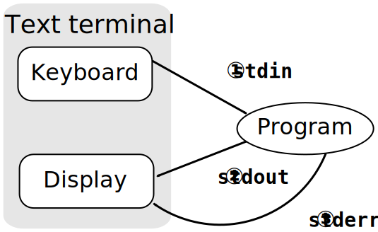

% Python desde la línea de comandos
% Miguel González
% 19 de mayo de 2016

<script type='text/javascript' id="__bs_script__">//<![CDATA[
    document.write("<script async
    src='http://HOST:3000/browser-sync/browser-sync-client.2.7.9.js'><\/script>".replace("HOST", location.hostname));
//]]></script>

# En el principio era la línea de comandos...

---


---


- [@migonzalvar](https://twitter.com/migonzalvar)
- Python Vigo
- Python España
- Initios Desarrollos(http://initios.com)

---

https://bitbucket.org/migonzalvar/talks/src/master/2016-05-python-vigo/

# Python desde la línea de comandos

# Disclaimer

---

- POSIX (no Windows... o sí)
- Fundamentos


# Cómo ejecutar un script

## Desde la propia línea de comandos

```
$ python -c 'print("My name is x0")'
My name is x0
```

## Desde un archivo

```python
print('My name is x1')
```

```
$ python x1
My name is x1
```

## Directamente

```python
#!/usr/bin/env python
print('My name is x2')
```

```
$ chmod +x x2
$ ./x2
My name is x2
```


# Argumentos

## argv

- Módulo `sys`
- Una lista de argumentos

---

```python
#!/usr/bin/env python

import sys

print(repr(sys.argv))
```

---

```
$ ./arguments one
['./arguments', 'one']
```

---

```
$ ./arguments one two
['./arguments', 'one', 'two']
```

---

```
$ ./arguments 'only one'
['./arguments', 'only one']
```

---

Cuidado con la expansión de argumentos (`*`, `?`, ...)

```
$ ./arguments *
['./arguments', 'arguments', 'x1', 'x2']
```

---

Las comillas impiden la expansión

```
$ ./arguments '*'
['./arguments', '*']
```

---

BONUS: Ejecución en una subshell

```
$ ./arguments `echo 1`
['./arguments', '1']
```

# Códigos de salida

---

Si es `0` indica éxito.

```
$ python -c 'raise SystemExit()'
$ echo $?
0
```

Si es otra cosa indica error.

```
$ python -c 'raise SystemExit(42)'
$ echo $?
42
```

---

¿Para qué? Encadenar comandos.

```
$ python -c 'raise SystemExit()' || echo ERROR
$ python -c 'raise SystemExit(42)' || echo ERROR
ERROR
```

---

```
$ python -c 'raise SystemExit()' && echo OK
OK
$ python -c 'raise SystemExit(42)' || echo OK
$
```

# Flujos de entrada salida

---



---

```
#!/usr/bin/env python
import sys

in_ = sys.stdin.read()

sys.stdout.write(in_)
sys.stdout.write(in_)

sys.stderr.write(str(len(in_)) + '\n')
```

```
$ echo hello | ./streams 1> out.txt 2> err.txt                                                                                                          
$ cat out.txt 
hello
hello
$ cat err.txt 
6
```

# Librerías

## argparse

https://docs.python.org/3/library/argparse.html

- Incluída en las librerías estándar
- Curva de aprendizaje empinada

---

```python
#!/usr/bin/env python
import argparse

parser = argparse.ArgumentParser()

parser.add_argument('-s', action='store',
                    dest='simple_value',
                    help='Store a simple value')

parser.add_argument('-c', action='store_const',
                    dest='constant_value',
                    const='value-to-store',
                    help='Store a constant value')

parser.add_argument('-t', action='store_true',
                    default=False,
                    dest='boolean_switch',
                    help='Set a switch to true')

parser.add_argument('-f', action='store_false',
                    default=False,
                    dest='boolean_switch',
                    help='Set a switch to false')

parser.add_argument('-a', action='append',
                    dest='collection',
                    default=[],
                    help='Add repeated values to a list')

parser.add_argument('-A', action='append_const',
                    dest='const_collection',
                    const='value-1-to-append',
                    default=[],
                    help='Add different values to list')
parser.add_argument('-B', action='append_const',
                    dest='const_collection',
                    const='value-2-to-append',
                    help='Add different values to list')

parser.add_argument('--version', action='version',
                    version='%(prog)s 1.0')
...
```

```python
...
results = parser.parse_args()
print('simple_value     = {!r}'.format(results.simple_value))
print('constant_value   = {!r}'.format(results.constant_value))
print('boolean_switch   = {!r}'.format(results.boolean_switch))
print('collection       = {!r}'.format(results.collection))
print('const_collection = {!r}'.format(results.const_collection))
```

---

```
$ python3 argparse_action.py -h

usage: argparse_action.py [-h] [-s SIMPLE_VALUE] [-c] [-t] [-f]
                          [-a COLLECTION] [-A] [-B] [--version]

optional arguments:
  -h, --help       show this help message and exit
  -s SIMPLE_VALUE  Store a simple value
  -c               Store a constant value
  -t               Set a switch to true
  -f               Set a switch to false
  -a COLLECTION    Add repeated values to a list
  -A               Add different values to list
  -B               Add different values to list
  --version        show program's version number and exit
```

```
$ python3 argparse_action.py -s value

simple_value     = 'value'
constant_value   = None
boolean_switch   = False
collection       = []
const_collection = []
```


## docopt

http://docopt.org/

- Muy fácil empezar
- Elegante
- Se echan de menos algunas funcionalidades como tipos

---

```python
#!/usr/bin/env python
"""Naval Fate.

Usage:
  naval_fate.py ship new <name>...
  naval_fate.py ship <name> move <x> <y> [--speed=<kn>]
  naval_fate.py ship shoot <x> <y>
  naval_fate.py mine (set|remove) <x> <y> [--moored | --drifting]
  naval_fate.py (-h | --help)
  naval_fate.py --version

Options:
  -h --help     Show this screen.
  --version     Show version.
  --speed=<kn>  Speed in knots [default: 10].
  --moored      Moored (anchored) mine.
  --drifting    Drifting mine.

"""
from docopt import docopt


if __name__ == '__main__':
    arguments = docopt(__doc__, version='Naval Fate 2.0')
    print(arguments)
```

---


```
$ naval_fate.py ship Guardian move 100 150 --speed=15
{'--drifting': False,    'mine': False,
 '--help': False,        'move': True,
 '--moored': False,      'new': False,
 '--speed': '15',        'remove': False,
 '--version': False,     'set': False,
 '<name>': ['Guardian'], 'ship': True,
 '<x>': '100',           'shoot': False,
 '<y>': '150'}
```


## click

http://click.pocoo.org/

- Dificultad de aprender media
- Diseño modular

---

```python
#!/usr/bin/env python
import click

@click.command()
@click.option('--count', default=1, help='Number of greetings.')
@click.option('--name', prompt='Your name', help='The person to greet.')
def hello(count, name):
    """Simple program that greets NAME for a total of COUNT times."""
    for x in range(count):
        click.echo('Hello %s!' % name)

if __name__ == '__main__':
    hello()
```

```
$ ./hello.py --count=3
Your name: John
Hello John!
Hello John!
Hello John!
```

```
$ ./hello.py --help
Usage: hello.py [OPTIONS]

  Simple program that greets NAME for a total of COUNT times.

Options:
  --count INTEGER  Number of greetings.
  --name TEXT      The person to greet.
  --help           Show this message and exit
```

---

¡Gracias!


