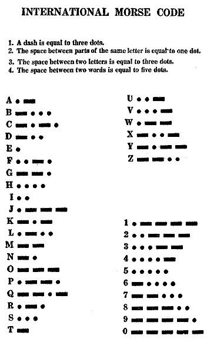

% Codificación de texto
% Miguel González
% 9/11/2016

# ¿Dónde está mi ñ?

## Bienvenida

Hola, buenas noches y gracias por venir.

Esta noche vamos a tratar de desentrañar uno de los misterios más
insondables de las ciencias de computación y es el misterio de


Porque, ¿a quién no le ha pasado esto alguna vez?

-----

Miguel Gonz�lez

¿Y esto?

-----



-----

💩

Pues eso

🙈 🙉 🙊

Empezamos...

\pagebreak

## Bienvenido

ℙℋℙ ⅤЇḠϴ

## 1836



-----

- El primer *wire protocol*
- Por la línea van bits . \_
-

## 1963


-----

- El más popular
- 7 bits

## 1981


-----

- Explosión con el OEM: Western, Greek, Russian

## 1991

Unicode

-----

- Code points no letras
- 1 millón
- Discusión geopolítica

## 2016

Emoji!

# Codificación de Unicode

## UCS-2 o UTF-16

- Muchos ceros
- BOM?

## UTF-8

- Compatible hacia atrás

# Cómo

## Formas de comunicar la Codificación

- Email

    Content-Type: text/plain; charset="UTF-8"

- HTML 5

    <meta charset="UTF-8">

- HTML arcaico

    <meta http-equiv="Content-Type" content="text/html;charset=UTF-8">

- XML

    <?xml version="1.0" encoding="UTF-8" ?>

- Apache server (configuración o .htaccess) sirve para que las cabeceras HTTP text/html y text/plain:

    AddDefaultCharset UTF-8

- MySQL

    CREATE DATABASE mydb CHARACTER SET utf8mb4 COLLATE utf8mb4_unicode_ci;


# Material extra

## Extra

Función PHP para crear errores. En python es:

``` {.sourceCode .python}
def foo(s):
    return s.encode('utf-8').decode('iso-8859-1')
```

## Referencias

-   <http://www.joelonsoftware.com/articles/Unicode.html>
-   <http://nedbatchelder.com/text/unipain.html>


## Curiosidades

- http://www.emojitracker.com/
- http://fsymbols.com/generators/encool/