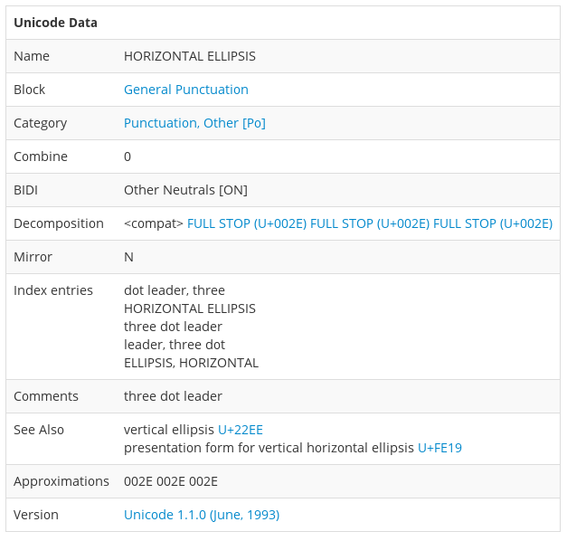

# ¿Dónde está mi ñ?

## PHP VIGO


<!--Esta noche vamos a tratar de desentrañar uno de los misterios más
insondables de las ciencias de computación y es el misterio de la
codificación de caracteres. ℙℋℙ ⅤЇḠϴ -->

Porque, ¿a quién no le ha pasado alguna vez?

# Miguel Gonz?lez

# 

# Un poco de historia

## 1836


## Morse

- El primer *wire protocol*
- Por la línea van bits . \_
- Optimiza longitud

    - E: 1 símbolos
    - Q: 4 símbolos

## 1963


## ASCII

- 7 bits
- 0 a 31: no imprimible
- Optimizado mayúsculas/minúsculas

## Quiz

- 10 LF ¿?
- 7 BEL ¿?

## 1981


## Códigos de página

- 8 bits
- Saca partido de los otros 128 caracteres
- Explosión con el OEM: Western, Greek, Russian
- Incluye acentos, caracteres, líneas...

## CP-1252


## 1991


## Unicode

- Code points no letras
- 1.114.112 code points de 0 a 10FFFF
- Discusión política
- Codificación... lo vemos después

## Ejemplos de code points

```
A
LATIN CAPITAL LETTER A (U+0041)

☠
SKULL AND CROSSBONES (U+2620)

😀
GRINNING FACE (U+1F600)
```
-----


## Ellipsis

… **'HORIZONTAL ELLIPSIS' (U+2026)**



## 2015


## Unicode 8

- Emoji
- Atención a la diversidad: fototipos 

# Codificación EN Unicode

## UCS-2 o UTF-16


## Problemas UTF-16

- Muchos ceros
- Confusión Little o big endian: Byte Order Mark (BOM)
- Muy complejo

## UTF-8


## Ventajas UTF-8

- Compatible hacia atrás con ASCII
- Muy eficiente para *code points* más usados: 1 para ASCII, 2 para la mayoría, sólo 3 en casos raros
- Decodificación:
    - Distinción multi byte y single byte
    - Auto sincronizable

# UTF-8 all the things

## Formas de comunicar la codificación

### Email

```
Content-Type: text/plain; charset="UTF-8"
```

### HTML 5

```
<meta charset="UTF-8">
```

### HTML arcaico

```
<meta http-equiv="Content-Type"
      content="text/html;charset=UTF-8">
```

## Configuración

### Apache server (configuración o .htaccess) sirve para que las cabeceras HTTP text/html y text/plain:

```
AddDefaultCharset UTF-8
```

### MySQL

```
CREATE DATABASE mydb
CHARACTER SET utf8mb4
COLLATE utf8mb4_unicode_ci;
```


# Solución

## ¿Dónde está mi ñ?

```
ñ
```

-----


-----

```
       C3        B1

1100 0011 1011 0001
```

-----


-----

```
___00011 __110001

1111 0001

U+F1

'LATIN SMALL LETTER N WITH TILDE'

```

## 

```
 ï  »  ¿

EF BB BF
```

Es el `Byte Order Mark` de UTF-8

# Gracias

# Saber más

## Enlaces

- http://www.joelonsoftware.com/articles/Unicode.html
- http://nedbatchelder.com/text/unipain.html
- http://www.emojitracker.com/
- http://fsymbols.com/generators/encool/
