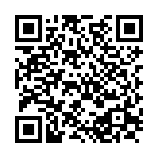

# ¿Dónde está mi ñ?

## PyDay Galicia


# Miguel Gonz?lez

# 

# Un poco de historia

## 1836


## Morse

- El primer *wire protocol*
- Por la línea van bits . \_
- Optimiza longitud

    - E: 1 símbolos
    - Q: 4 símbolos

## 1874


## Baudot

- 5 bits
- Optimiza facilidad de uso
- Código de control *erasure*

## 1900


## Cinta perforada

- Teletipo (TTY)
- Tecla de cambio de función: letras, símbolos, meteorológico

## 1963


## ASCII

- 7 bits
- 0 a 31: no imprimible
- Optimizado mayúsculas/minúsculas

## Quiz

- 10 LF ¿?
- 7 BEL ¿?

## 1981


## Códigos de página

- 8 bits
- Saca partido de los otros 128 caracteres
- Explosión con el OEM: Western, Greek, Russian
- Incluye acentos, caracteres, líneas...

## CP-1252


## 1991


## Unicode

- Code points no letras
- 1.114.112 code points de 0 a 10FFFF
- Discusión política
- Codificación... lo vemos después

## Ejemplos de code points

```
A
LATIN CAPITAL LETTER A (U+0041)

☠
SKULL AND CROSSBONES (U+2620)

😀
GRINNING FACE (U+1F600)
```

-----


## Ellipsis

… **'HORIZONTAL ELLIPSIS' (U+2026)**


## 2015


## Unicode 8

- Emoji

## Fototipos (escala Fitzpatrick)


# Codificación Unicode

## UCS-2 o UTF-16

- Cualquier carácter Unicode.
- Longitud variable: 2 ó 4 bytes
- Optimizado rango U+0000 a U+FFFF (BMP o *plano básico multilingüe*)
- Resto: planos surrogados: No superposición: Los símbolos de 1 palabra (16 bits) utilizan un subconjunto de valores que no puede utilizarse en símbolos de 2 palabras (32 bits).

## Planos surrogados


## Problemas UTF-16

- Muchos ceros
- Confusión Little o big endian: Byte Order Mark (BOM)
- Muy complejo

## UTF-8


## Ventajas UTF-8

- Compatible hacia atrás con ASCII
- Muy eficiente para *code points* más usados: 1 para ASCII, 2 para BMP, 3 en resto
- Decodificación:
    - Distinción multi byte y single byte
    - Auto sincronizable

## Ejemplo: a (U+0061)


## Ejemplo: Ñ (U+00D1)


## Ejemplo: 🐍 (U+1F40D)


## En resumen...

----


# Python

## Python 2


## Python 3


# Mundo exterior

## Archivos

- BOM: no recomendado
- ¿Adivinar?

## chardet

```python
>>> import urllib
>>> rawdata = urllib.urlopen('http://yahoo.co.jp/').read()
>>> import chardet
>>> chardet.detect(rawdata)
{'encoding': 'EUC-JP', 'confidence': 0.99}
```

## Email

```
Content-Type: text/plain; charset="UTF-8"
```

## HTML 5

```
<meta charset="UTF-8">
```

## HTML arcaico

```
<meta http-equiv="Content-Type"
      content="text/html;charset=UTF-8">
```

## Apache server (configuración o .htaccess) sirve para que las cabeceras HTTP text/html y text/plain:

```
AddDefaultCharset UTF-8
```

## MySQL

```
CREATE DATABASE mydb
CHARACTER SET utf8mb4
COLLATE utf8mb4_unicode_ci;
```


# Solución

## LF

- Código control **line feed** que avanza el el rodillo de papel un línea

## BEL

- Código control de campana. Inventado por Western Union y recogido en ASCII.

## ¿Dónde está mi ñ?


```
ñ
```

-----


-----

```
       C3        B1
```

```
1100 0011 1011 0001
```

-----


-----

```
___00011 __110001
```

```
1111 0001
```

```
U+F1
```

**LATIN SMALL LETTER N WITH TILDE**

## 

```
 ï  »  ¿
```

Usando *Latin1*:

```
EF BB BF
```

Es el `Byte Order Mark` de UTF-8.

# Saber más

## Enlaces

- http://www.joelonsoftware.com/articles/Unicode.html
- http://nedbatchelder.com/text/unipain.html
- http://www.emojitracker.com/
- http://fsymbols.com/generators/encool/

## ¡Gracias!

- 
- 
- 
