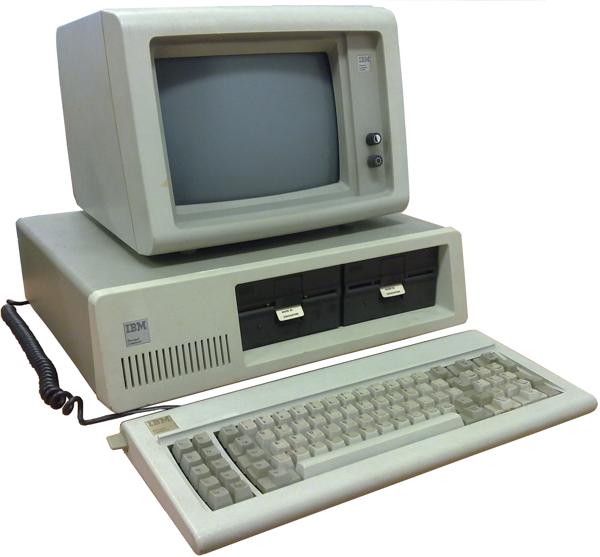

:title: ¿Dónde está mi ñ?
:data-transition-duration: 1000
:css: css/custom.css
:skip-help:	true

----

¿Dónde está mi ñ?
====================

Codificación de caracteres
--------------------------

Miguel Gonz�lez
^^^^^^^^^^^^^^^

----

Historia
========

----

:data-x: r300
:data-scale: 0.05

1836 - Morse
============

----

.. image:: images/L-Telegraph1.png

----

.. image:: images/International_Morse_code.png

----

1874 - Baudot
=============

----

----

.. image:: images/Baudot_Code_-_from_1888_patent.png
    :height: 600px
    :width: 800px

.. note::

	Baudot da nombre al *baudio*

	JOKE: El teclado es el iPhone.

----

1900 - Murray
=============

----

.. image:: images/jiee-v34-1905-01919-p579ff-pdf615-fig017-murray-keyboard-perforator-open-rewatermarked.jpg
    :height: 600px
    :width: 800px

----

.. image:: images/5-holes-tape.png

----

1963 - ASCII
============

----

.. image:: images/ASR-33_at_CHM.agr.jpg
    :height: 600px
    :width: 800px

----

.. image:: images/US-ASCII_code_chart.png
    :height: 600px
    :width: 800px

.. note::

	JOKE: Estándar: 15 formas de hacer las cosas así que deines un estándar y así ya hay 16.

----

1981 - IBM PC
=============

----

----

.. image:: images/Codepage-437.png
    :height: 600px
    :width: 800px

----

1991 - Unicode
==============

----

.. image:: images/Schneider_Amstrad_PC_1512_DD_Transparent_BG.png
    :height: 600px

----

.. image:: images/CP-1252.png
    :height: 600px
    :width: 800px

----

2010 - Unicode v6 Emoji
=======================

----

.. image:: images/apple-iphone-3g-02.jpg
    :height: 600px

----

.. image:: images/emoji-examples.png

----

2015 - Unicode v8 Fototipos
===========================

----

.. image:: images/WhatsApp_Logo_1.png

----

.. image:: images/unicode_diversity.png
    :width: 800px

----

:data-x: r3000
:data-scale: 0.5

Codificación
============

.. note::

	Explicar UTF-8

----

Ejemplos prácticos
==================

----

.. image:: images/encode-decode.png

----

:data-x: r3000
:data-scale: 1

----

Muchas gracias
==============
