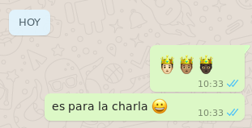
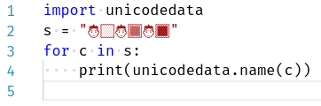

:title: ¿Dónde está mi ñ?
:data-transition-duration: 1000
:css: css/custom.css
:skip-help: true

.. header::

    .. image:: images/pycones.png

.. footer::

    @migonzalvar

----

¿Dónde está mi ñ?
====================

Codificación de caracteres
--------------------------

----

Miguel Gonz�lez
===============

----

Historia
========

.. note::

    Desde el punto de vista histórico:

    - Empezando menos sofisticado
    - Entender evolución y explicar de donde vienen algunas rarezas

----

:data-x: r300
:data-scale: 0.05

1836 - Morse
============

----

.. image:: images/L-Telegraph1.png

.. note::

    Explicar tecnología telégrafo. *wire protocol*.

----

.. image:: images/International_Morse_code.png

.. note::

    Objetivo:

    - Compresión
    - Letras más usadas en inglés

----

1874 - Baudot
=============

----

.. image:: images/Clavier_Baudot.jpg
    :height: 600px
    :width: 800px

.. note::

    Baudot da nombre al *baudio*. Explicar que es más
    *ergonómico*. Más velocidad por ello. Ritmo.

----

.. note::

    5 bits, 32 símbolos.
    Primer código de control: erasure/borrado.

----

1900 - Murray
=============

----

.. image:: images/jiee-v34-1905-01919-p579ff-pdf615-fig017-murray-keyboard-perforator-open-rewatermarked.jpg
    :height: 600px
    :width: 800px

----

.. note::

    Se puede almacenar y reproducir.
    Línea del centro para enganchar.
    Más códigos de control.
    Curiosidad: para cortar la cinta

----

1963 - ASCII
============

----

.. image:: images/ASR-33_at_CHM.agr.jpg
    :height: 600px
    :width: 800px

.. note::

    Máquina Teletype Model 33 ASR, subsidiaria de AT&T
    Democratizó la tecnología.
    Se uso como terminal de ordenador! antes de los VTY

----

.. image:: images/US-ASCII_code_chart.png
    :height: 600px
    :width: 800px

.. note::

    JOKE: Estándar: 15 formas de hacer las cosas así que haces un estándar y así ya hay 16.
    - 7 bits, seguro que llega
    - bit para cambiar mays

----

1981 - IBM PC
=============

----

.. image:: images/Ibm_pc_5150.jpg
    :height: 600px
    :width: 800px

----

.. image:: images/Codepage-437.png
    :height: 600px
    :width: 800px

.. note::

    En ROM de la tarjeta gráfica. Un *jumper* para cambiar. Impresoras. Naomi lo citó.
    Interfaces visuales: bordes!

----

1988 - Windows
==============

----

.. image:: images/Schneider_Amstrad_PC_1512_DD_Transparent_BG.png
    :height: 600px

----

.. image:: images/CP-1252.png
    :height: 600px
    :width: 800px

.. note::

    - Super conjunto ISO-8859-1
    - Soporte en un sólo código a lenguas europeas.
    - Fue el más usado en Internet durante años

----

1991 - Unicode
==============

----

----

.. image:: images/unicode25cake-utc147-design.jpg

.. note::

    Que es el Unicode consortium

----

.. image:: images/horizontal-ellipsis.png

.. note::

    Explicar concepto *code point*: representación ideal, platónico

----

2010 (v6) - Emoji
-----------------

----

.. image:: images/apple-iphone-3g-02.jpg
    :height: 600px

----

.. image:: images/emoji-examples.png

----

2015 (v8) - Fototipos
---------------------

----

.. image:: images/screen-1-phone.png
    :height: 600px

----

.. image:: images/unicode_diversity.png
    :width: 800px

----

:data-x: r3000
:data-scale: 0.5

Codificación
------------

.. note::

    Pero falta pasarlo a bytes, a lo que realmente se transmite, se guarda.

----

.. image:: images/utf-8.png

.. note::

    Explicar UTF-8:

    - Soporta vaios lenguajes a la vez
    - 1, 2 o 3 bytes
    - Todo el espacio Unicode

    Propiedades:

    - 1 byte == ASCII
    - 2 bytes mayoría lenguas: sólo mejor códigos de página especializados
    - Sincronizable, detecta truncamientos...

----

Python práctico
===============

----

.. image:: images/encode-decode.png
    :width: 800px

----

ASCII
-----

----

.. code:: pycon

    >>> b'\x42'.decode('ascii')
    'B'
    >>> b'\x42'.decode('Windows-1252')
    'B'
    >>> b'\x42'.decode('utf-8')
    'B'

----

Windows-1252
------------

----

.. code:: pycon

    >>> b'\xf1'.decode('Windows-1252')
    'ñ'

----

.. code:: pycon

    >>> b'\xf1'.decode('ascii')
    Traceback (most recent call last):
      File "<stdin>", line 1, in <module>
    UnicodeDecodeError: 'ascii' codec can't 
     decode byte 0xf1 in position 0: ordinal
     not in range(128)

----

.. code:: pycon

    >>> b'\xf1'.decode('utf-8')
    Traceback (most recent call last):
      File "<stdin>", line 1, in <module>
    UnicodeDecodeError: 'utf-8' codec can't 
     decode byte 0xf1 in position 0: unexpected
     end of data

----

.. code::

    F1 --> 1111 0001

.. image:: images/utf-8.png

----

.. code:: pycon

    >>> b'\xf1'.decode(
    ...   'utf-8',
    ...   errors='replace'
    ... )
    '�'

----

UTF-8
-----

----

.. code:: pycon

    >>> b'\xc3\xb1'.decode('utf-8')
    'ñ'

----

.. code:: pycon

    >>> b'\xc3\xb1'.decode('Windows-1252')
    'ñ'

----

Emoji
-----

----

----

.. code:: pycon

    >>> import unicodedata
    >>> s = "🤴🏻🤴🏽🤴🏿"
    >>> for c in s: print(unicodedata.name(c))
    ... 
    PRINCE
    EMOJI MODIFIER FITZPATRICK TYPE-1-2
    PRINCE
    EMOJI MODIFIER FITZPATRICK TYPE-4
    PRINCE
    EMOJI MODIFIER FITZPATRICK TYPE-6

----

----

Conclusiones
============

.. note::
    
    - No es magia
    - Raíces más de un siglo de histsoria
    - Diversidad

----

:data-x: r3000
:data-scale: 1

Muchas gracias
==============
